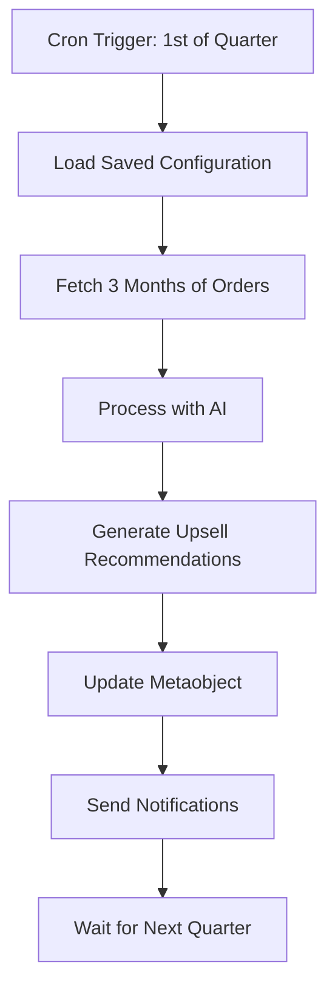

# 🕐 Quarterly Cron Job Setup Guide

## Overview
This guide will help you set up automated quarterly processing of your Shopify orders with AI-powered upsell recommendations.

## 🎯 What This Does
- **Runs every 3 months** (quarterly) on the 1st day at midnight
- **Processes 3 months** of historical order data
- **Generates upsell recommendations** using AI
- **Stores results** in Shopify metaobjects
- **Automatically updates** your upsell configuration

## 📅 Cron Schedule Options

### Available Schedules:
- **Quarterly (Recommended)**: `0 0 1 */3 *` - Every 3 months on 1st at midnight
- **Monthly**: `0 0 1 * *` - Every month on 1st at midnight  
- **Biannually**: `0 0 1 */6 *` - Every 6 months on 1st at midnight
- **Yearly**: `0 0 1 1 *` - Every January 1st at midnight
- **Weekly**: `0 0 * * 0` - Every Sunday at midnight

## 🚀 Quick Start

### Option 1: Use the App Interface (Recommended)
1. Open your Shopify app
2. Go to "Upsell Configuration" page
3. Set **Schedule** to "Quarterly (3 months)"
4. Set **Data Analysis Period** to "3 months"
5. Click **"Save Configuration"** 
6. Cron jobs will start automatically! ✅

### Option 2: Manual Command Line Setup
```bash
# Start cron jobs manually
npm run start:cron

# This will:
# - Initialize quarterly cron jobs
# - Run every 3 months
# - Process 3 months of data
# - Keep running in background
```

## ⚙️ Configuration

### Default Quarterly Settings:
```javascript
{
  schedule: "quarterly",        // Every 3 months
  dataPeriod: 3,               // Process 3 months of data
  aiProvider: "openai",        // AI service
  confidenceThreshold: 0.7,    // AI confidence level
  maxBatches: 20,              // Max data batches
  enableNotifications: true    // Enable alerts
}
```

### Customizing Your Schedule:
1. **In the App**: Use the Configuration tab to change settings
2. **Via API**: Send POST to `/api/automation` with action `saveConfiguration`
3. **Direct Code**: Modify `start-cron.js` default config

## 📊 What Happens During Each Run

### Quarterly Processing Flow:


### Data Processing:
1. **Orders Export**: Fetches last 3 months of orders
2. **AI Analysis**: Identifies buying patterns and co-purchases
3. **Upsell Generation**: Creates main_product → upsellVariants pairs
4. **Storage**: Updates your `upsell_config` metaobject
5. **Logging**: Records success/failure in console

## 🔧 Management Commands

### Via App Interface:
- **Save Configuration**: Updates cron jobs automatically
- **Manual Processing**: Run processing immediately
- **View Status**: Check last run results

### Via API Calls:
```javascript
// Start cron jobs
POST /api/automation
{ action: "manageCronJobs", cronAction: "start", schedule: "quarterly", dataPeriod: 3 }

// Stop cron jobs
POST /api/automation
{ action: "manageCronJobs", cronAction: "stop" }

// Get status
POST /api/automation
{ action: "manageCronJobs", cronAction: "status" }
```

## 📈 Monitoring & Logs

### Console Logs:
```bash
🚀 Initializing Cron Service...
⏰ Quarterly order export scheduled with pattern: 0 0 1 */3 *
📅 Schedule: Quarterly (every 3 months on the 1st at midnight)
📊 Data Period: 3 months of historical data
🔄 Next run: 1st day of next quarter
✅ Cron jobs initialized successfully!
```

### During Processing:
```bash
📅 Running quarterly order export and AI processing...
📊 Processing 3 months of data (Oct 1, 2024 to Jan 1, 2025)
📦 Found 1,247 orders
🤖 Processing with AI...
💾 Storing results in metaobject...
✅ Processing completed successfully
```

## 🔄 Next Run Schedule

If you start the cron job today, here's when it will run next:

| Current Date | Next Quarterly Run |
|--------------|-------------------|
| January 2025 | April 1, 2025 |
| February 2025 | April 1, 2025 |
| March 2025 | April 1, 2025 |
| April 2025 | July 1, 2025 |
| May 2025 | July 1, 2025 |
| June 2025 | July 1, 2025 |

## 🛠️ Troubleshooting

### Common Issues:

#### Cron Not Starting:
```bash
# Check if node-cron is installed
npm list node-cron

# Reinstall if missing
npm install node-cron
```

#### Configuration Not Saving:
1. Check metaobject permissions in Shopify
2. Verify `SHOPIFY_API_SECRET` is set
3. Check console for error messages

#### AI Processing Failing:
1. Verify `OPENAI_API_KEY` is set
2. Check API quotas and limits
3. Review error logs in console

### Debug Commands:
```bash
# Test configuration loading
POST /api/automation
{ action: "loadConfiguration" }

# Test cron status
POST /api/automation  
{ action: "manageCronJobs", cronAction: "status" }

# Manual processing test
POST /api/automation
{ action: "processOrders", dataPeriod: 3 }
```

## 🎉 Success Indicators

### ✅ Setup Complete When You See:
- Cron jobs running in status check
- Configuration saved in metaobject
- Next run date calculated correctly
- Test processing works manually

### 📊 Quarterly Processing Success:
- Orders fetched from correct 3-month period
- AI generates upsell recommendations
- Metaobject updated with new data
- Console shows "Processing completed successfully"

## 🔐 Security Notes

- Cron jobs run with your app's Shopify permissions
- API keys are required for AI processing
- All data stays within your Shopify store
- Metaobjects are private to your store

## 📞 Support

If you need help:
1. Check the console logs for error messages
2. Verify all environment variables are set
3. Test manual processing first
4. Review the troubleshooting section above

---

**🎯 Perfect! Your quarterly cron job will now automatically analyze 3 months of order data every quarter and update your upsell recommendations!**

