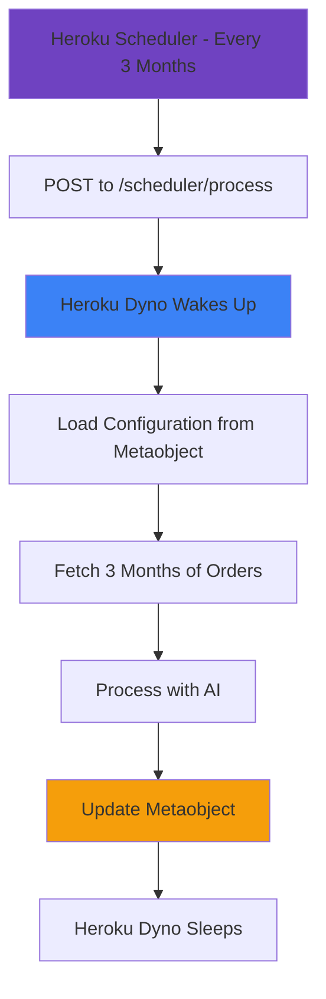

# 🚀 Heroku Deployment Guide for Orders Export App

## Why Heroku?
- ✅ **Well-established platform**
- ✅ **Great for Shopify apps**
- ✅ **Excellent documentation**
- ✅ **Built-in Heroku Scheduler**
- ✅ **Easy scaling**

## 🎯 Heroku Scheduler Strategy

Your app uses **Heroku Scheduler** to run quarterly processing. Simple, reliable, and built into Heroku!

## 🔧 Step-by-Step Setup

### 1. Install Heroku CLI
```bash
# macOS
brew tap heroku/brew && brew install heroku

# Windows
# Download from: https://devcenter.heroku.com/articles/heroku-cli

# Ubuntu/Linux
curl https://cli-assets.heroku.com/install.sh | sh
```

### 2. Login and Create App
```bash
# Login to Heroku
heroku login

# Create your app (choose a unique name)
heroku create your-orders-export-app

# Or if you want to specify region
heroku create your-orders-export-app --region us
```

### 3. Set Environment Variables
```bash
# Set all required environment variables
heroku config:set SHOPIFY_API_KEY=your_shopify_api_key
heroku config:set SHOPIFY_API_SECRET=your_shopify_api_secret
heroku config:set SHOPIFY_SHOP_DOMAIN=your-shop.myshopify.com
heroku config:set OPENAI_API_KEY=your_openai_api_key

# Heroku will provide DATABASE_URL automatically when you add Postgres
```

### 4. Add Postgres Database (Required)
```bash
# Add free Postgres database
heroku addons:create heroku-postgresql:mini

# This automatically sets DATABASE_URL
```

### 5. Deploy Your App
```bash
# Add Heroku remote (if not done automatically)
heroku git:remote -a your-orders-export-app

# Deploy
git add .
git commit -m "Deploy to Heroku"
git push heroku main
```

### 6. Verify Deployment
```bash
# Open your app
heroku open

# Check logs
heroku logs --tail
```

## ⏰ Heroku Scheduler Setup

### Add Heroku Scheduler:
```bash
# Add Heroku Scheduler add-on
heroku addons:create scheduler:standard -a your-app-name
```

### Configure Quarterly Job:
1. **Open Heroku Dashboard** → Your App → Resources → Heroku Scheduler
2. **Click "Create job"**
3. **Set schedule**: Every 3 months (or use cron: `0 0 1 */3 *`)
4. **Set command**: `curl -X POST https://your-app-name.herokuapp.com/scheduler/process`
5. **Save the job**

### Alternative: Use Heroku CLI
```bash
# Create quarterly job via CLI
heroku addons:open scheduler -a your-app-name
```

## 🧪 Testing Your Setup

### Test the Scheduler Endpoint:
```bash
# Test the endpoint directly
curl -X POST https://your-app-name.herokuapp.com/scheduler/process

# Or test GET for info
curl https://your-app-name.herokuapp.com/scheduler/process
```

### Test via Heroku Dashboard:
1. Go to Heroku Dashboard → Your App → Resources → Heroku Scheduler
2. Find your job and click "Run now" to test

## 📊 Heroku-Specific Configuration

### Procfile (Already Configured in package.json)
Heroku uses your `package.json` start script:
```json
{
  "scripts": {
    "start": "remix-serve ./build/server/index.js"
  }
}
```

### Build Process:
```bash
# Heroku automatically runs:
npm install
npm run build
npm start
```

## 🔧 Heroku Dashboard Monitoring

### View Logs:
```bash
# Real-time logs
heroku logs --tail

# Last 1000 lines
heroku logs -n 1000
```

### Monitor Performance:
- Go to Heroku Dashboard
- Click your app
- View metrics, logs, and activity

## 💰 Heroku Pricing for Your App

### Free Tier (Deprecated):
- Heroku no longer offers free tier

### Eco Dynos ($5/month):
- ✅ Perfect for your quarterly processing
- ✅ Sleeps after 30 min of inactivity
- ✅ Wakes up when GitHub Actions calls webhook

### Basic Dynos ($7/month):
- ✅ Never sleeps
- ✅ Better for frequent processing
- ✅ More reliable

## 🚀 Complete Heroku Commands Reference

```bash
# Initial setup
heroku login
heroku create your-app-name
heroku addons:create heroku-postgresql:mini

# Environment variables
heroku config:set VAR_NAME=value
heroku config:get VAR_NAME
heroku config

# Deployment
git push heroku main
heroku releases
heroku rollback v123

# Monitoring
heroku logs --tail
heroku ps
heroku open

# Database
heroku pg:info
heroku pg:psql

# Scaling
heroku ps:scale web=1
heroku ps:restart
```

## 🎯 Quarterly Processing Flow on Heroku



## 🔍 Troubleshooting

### Common Issues:

#### App Won't Start:
```bash
# Check logs
heroku logs --tail

# Common fixes:
heroku config:set NODE_ENV=production
heroku restart
```

#### Database Connection Issues:
```bash
# Check DATABASE_URL is set
heroku config:get DATABASE_URL

# Reset database
heroku pg:reset DATABASE_URL --confirm your-app-name
```

#### Scheduler Not Working:
```bash
# Test scheduler endpoint
curl -X POST "https://your-app.herokuapp.com/scheduler/process"

# Check scheduler logs
heroku logs --tail -a your-app-name
```

## 🎉 Advantages of Heroku for Your App

### ✅ Pros:
- **Reliable platform** with excellent uptime
- **Easy deployment** with Git-based workflow
- **Built-in Heroku Scheduler** - no external dependencies
- **Great add-ons ecosystem** (Postgres, Redis, etc.)
- **Excellent logging** and monitoring
- **Easy scaling** when you grow

### ❌ Cons:
- **No free tier** anymore
- **Dyno sleeping** on Eco tier (but Scheduler wakes it up)
- **Scheduler costs extra** ($25/month for Standard dynos minimum)

## 📅 Your Quarterly Schedule

Once deployed, your system will run:
- **January 1st** → Process Oct-Dec orders
- **April 1st** → Process Jan-Mar orders  
- **July 1st** → Process Apr-Jun orders
- **October 1st** → Process Jul-Sep orders

## 🎯 Next Steps

1. **Deploy to Heroku** using the commands above
2. **Add Heroku Scheduler** add-on
3. **Configure quarterly job** in Heroku Dashboard
4. **Test the scheduler** to ensure everything works
5. **Wait for quarterly processing** or trigger manually

**Your Heroku app with Scheduler is ready for quarterly order processing!** 🚀

