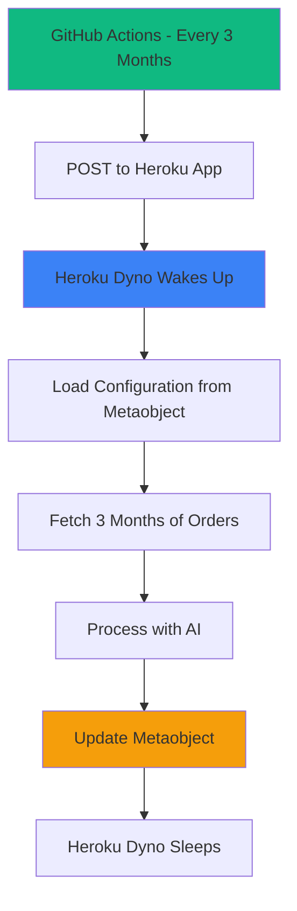

# 🚀 Heroku Deployment Guide for Orders Export App

## Why Heroku?
- ✅ **Well-established platform**
- ✅ **Great for Shopify apps**
- ✅ **Excellent documentation**
- ✅ **Many add-ons available**
- ✅ **Easy scaling**

## 🎯 Heroku + GitHub Actions Strategy

Since Heroku doesn't have built-in cron jobs in the free tier, we'll use **GitHub Actions** to trigger your quarterly processing. This is actually **more reliable** than Heroku's scheduler!

## 🔧 Step-by-Step Setup

### 1. Install Heroku CLI
```bash
# macOS
brew tap heroku/brew && brew install heroku

# Windows
# Download from: https://devcenter.heroku.com/articles/heroku-cli

# Ubuntu/Linux
curl https://cli-assets.heroku.com/install.sh | sh
```

### 2. Login and Create App
```bash
# Login to Heroku
heroku login

# Create your app (choose a unique name)
heroku create your-orders-export-app

# Or if you want to specify region
heroku create your-orders-export-app --region us
```

### 3. Set Environment Variables
```bash
# Set all required environment variables
heroku config:set SHOPIFY_API_KEY=your_shopify_api_key
heroku config:set SHOPIFY_API_SECRET=your_shopify_api_secret
heroku config:set WEBHOOK_SECRET=your_secure_random_token
heroku config:set OPENAI_API_KEY=your_openai_api_key

# Heroku will provide DATABASE_URL automatically when you add Postgres
```

### 4. Add Postgres Database (Required)
```bash
# Add free Postgres database
heroku addons:create heroku-postgresql:mini

# This automatically sets DATABASE_URL
```

### 5. Deploy Your App
```bash
# Add Heroku remote (if not done automatically)
heroku git:remote -a your-orders-export-app

# Deploy
git add .
git commit -m "Deploy to Heroku"
git push heroku main
```

### 6. Verify Deployment
```bash
# Open your app
heroku open

# Check logs
heroku logs --tail
```

## ⏰ Cron Job Setup (GitHub Actions)

### Your GitHub Actions workflow is already configured! Here's how it works:

1. **GitHub Actions runs quarterly** (every 3 months)
2. **Calls your Heroku app's webhook**
3. **Your app processes orders and updates metaobjects**

### Set GitHub Secrets:
Go to your GitHub repo → Settings → Secrets and variables → Actions

Add these secrets:
- `APP_URL`: `https://your-orders-export-app.herokuapp.com`
- `WEBHOOK_SECRET`: `your_secure_random_token` (same as Heroku config)
- `SHOPIFY_SHOP_DOMAIN`: `your-shop.myshopify.com`

## 🧪 Testing Your Setup

### Test Locally First:
```bash
# Test webhook locally
WEBHOOK_SECRET=your_token SHOPIFY_SHOP_DOMAIN=your-shop.myshopify.com npm run test:webhook
```

### Test Production:
```bash
# Update external-cron-trigger.js with your Heroku URL
# Then test:
APP_URL=https://your-orders-export-app.herokuapp.com npm run trigger:cron
```

## 📊 Heroku-Specific Configuration

### Procfile (Already Configured in package.json)
Heroku uses your `package.json` start script:
```json
{
  "scripts": {
    "start": "remix-serve ./build/server/index.js"
  }
}
```

### Build Process:
```bash
# Heroku automatically runs:
npm install
npm run build
npm start
```

## 🔧 Heroku Dashboard Monitoring

### View Logs:
```bash
# Real-time logs
heroku logs --tail

# Last 1000 lines
heroku logs -n 1000
```

### Monitor Performance:
- Go to Heroku Dashboard
- Click your app
- View metrics, logs, and activity

## 💰 Heroku Pricing for Your App

### Free Tier (Deprecated):
- Heroku no longer offers free tier

### Eco Dynos ($5/month):
- ✅ Perfect for your quarterly processing
- ✅ Sleeps after 30 min of inactivity
- ✅ Wakes up when GitHub Actions calls webhook

### Basic Dynos ($7/month):
- ✅ Never sleeps
- ✅ Better for frequent processing
- ✅ More reliable

## 🚀 Complete Heroku Commands Reference

```bash
# Initial setup
heroku login
heroku create your-app-name
heroku addons:create heroku-postgresql:mini

# Environment variables
heroku config:set VAR_NAME=value
heroku config:get VAR_NAME
heroku config

# Deployment
git push heroku main
heroku releases
heroku rollback v123

# Monitoring
heroku logs --tail
heroku ps
heroku open

# Database
heroku pg:info
heroku pg:psql

# Scaling
heroku ps:scale web=1
heroku ps:restart
```

## 🎯 Quarterly Processing Flow on Heroku



## 🔍 Troubleshooting

### Common Issues:

#### App Won't Start:
```bash
# Check logs
heroku logs --tail

# Common fixes:
heroku config:set NODE_ENV=production
heroku restart
```

#### Database Connection Issues:
```bash
# Check DATABASE_URL is set
heroku config:get DATABASE_URL

# Reset database
heroku pg:reset DATABASE_URL --confirm your-app-name
```

#### Webhook Not Working:
```bash
# Test webhook endpoint
curl -X POST "https://your-app.herokuapp.com/webhooks/cron/trigger" \
  -H "Authorization: Bearer your-webhook-secret" \
  -d "shop=your-shop.myshopify.com"
```

## 🎉 Advantages of Heroku for Your App

### ✅ Pros:
- **Reliable platform** with excellent uptime
- **Easy deployment** with Git-based workflow
- **Great add-ons ecosystem** (Postgres, Redis, etc.)
- **Excellent logging** and monitoring
- **Easy scaling** when you grow

### ❌ Cons:
- **No free tier** anymore
- **Dyno sleeping** on Eco tier (but GitHub Actions wakes it up)
- **More expensive** than some alternatives

## 📅 Your Quarterly Schedule

Once deployed, your system will run:
- **January 1st** → Process Oct-Dec orders
- **April 1st** → Process Jan-Mar orders  
- **July 1st** → Process Apr-Jun orders
- **October 1st** → Process Jul-Sep orders

## 🎯 Next Steps

1. **Deploy to Heroku** using the commands above
2. **Set GitHub Secrets** with your Heroku app URL
3. **Test the webhook** to ensure everything works
4. **Wait for quarterly processing** or trigger manually

**Your Heroku app will be perfect for quarterly order processing!** 🚀

