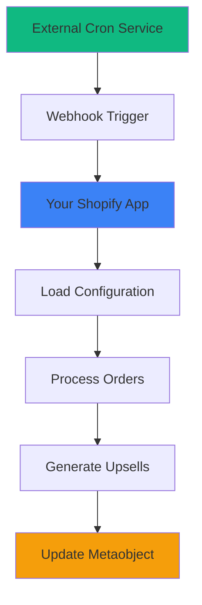

# 🚀 Production Cron Job Setup Guide

## The Problem You Asked About
You're absolutely right! The `node-cron` approach only works when your local server is running. For **production**, you need **external triggers**.

## 🎯 Production Solutions

### **Option 1: GitHub Actions (Recommended - FREE)**
✅ **Completely free**  
✅ **Reliable cloud-based**  
✅ **Automatic quarterly triggers**  
✅ **No server maintenance**

#### Setup:
1. **Push your code to GitHub**
2. **Add GitHub Secrets:**
   - `APP_URL` = Your deployed app URL (e.g., `https://your-app.vercel.app`)
   - `WEBHOOK_SECRET` = Your webhook secret token
   - `SHOPIFY_SHOP_DOMAIN` = Your shop domain (e.g., `your-shop.myshopify.com`)
3. **The workflow runs automatically every 3 months!**

### **Option 2: Vercel Cron (If using Vercel)**
✅ **Built-in to Vercel**  
✅ **No external setup needed**  
✅ **Automatic scaling**

#### Setup:
1. **Deploy to Vercel**
2. **The `vercel.json` file is already configured**
3. **Runs automatically every 3 months!**

### **Option 3: External Server/VPS**
✅ **Full control**  
✅ **Works with any hosting**  
✅ **Traditional crontab approach**

#### Setup on Ubuntu/Linux:
```bash
# 1. Upload external-cron-trigger.js to your server
# 2. Install dependencies
npm install node-fetch

# 3. Set environment variables
export APP_URL="https://your-app.vercel.app"
export WEBHOOK_SECRET="your-secret-token"
export SHOPIFY_SHOP_DOMAIN="your-shop.myshopify.com"

# 4. Add to crontab (every 3 months on 1st at midnight)
crontab -e
# Add this line:
0 0 1 */3 * /usr/bin/node /path/to/external-cron-trigger.js
```

### **Option 4: AWS Lambda/Google Cloud Functions**
✅ **Serverless**  
✅ **Pay per execution**  
✅ **Highly scalable**

#### Setup:
1. **Create a cloud function with `external-cron-trigger.js`**
2. **Set up CloudWatch/Cloud Scheduler to trigger quarterly**
3. **Configure environment variables**

## 🔧 How It Works

### **Architecture:**


### **Flow:**
1. **🕐 External Timer**: GitHub Actions/Vercel/Server triggers quarterly
2. **🔔 Webhook Call**: Calls `/webhooks/cron/trigger` with authentication
3. **🏪 Shop Context**: Your app loads the correct shop configuration
4. **📊 Processing**: Runs the same order processing logic
5. **💾 Storage**: Updates your metaobject with results

## 🛠️ Implementation Details

### **Webhook Endpoint**: `/webhooks/cron/trigger`
- **Authentication**: Bearer token with your `WEBHOOK_SECRET`
- **Shop Context**: Passes shop domain for multi-store support
- **Error Handling**: Returns detailed success/failure responses
- **Timeout**: Configured for long-running processing

### **Security:**
- **Bearer token authentication** prevents unauthorized access
- **Shop domain validation** ensures correct store context
- **Request logging** for debugging and monitoring

## 🚀 Quick Start (GitHub Actions)

### **1. Push to GitHub:**
```bash
git add .
git commit -m "Add production cron setup"
git push origin main
```

### **2. Add Secrets in GitHub:**
Go to **Settings > Secrets and Variables > Actions**:
- `APP_URL`: `https://your-app-domain.vercel.app`
- `WEBHOOK_SECRET`: `your-secure-random-token`
- `SHOPIFY_SHOP_DOMAIN`: `your-shop.myshopify.com`

### **3. Test Manually:**
Go to **Actions > Quarterly Order Processing > Run workflow**

### **4. Verify:**
Check your app logs and metaobject for updates!

## 📅 Scheduling Options

| Service | Cron Expression | When It Runs |
|---------|----------------|--------------|
| **GitHub Actions** | `0 0 1 */3 *` | Every 3 months on 1st |
| **Vercel Cron** | `0 0 1 */3 *` | Every 3 months on 1st |
| **Linux Crontab** | `0 0 1 */3 *` | Every 3 months on 1st |
| **AWS EventBridge** | `cron(0 0 1 */3 *)` | Every 3 months on 1st |

## 🔍 Testing Your Setup

### **Test the Webhook Directly:**
```bash
curl -X POST "https://your-app.vercel.app/webhooks/cron/trigger" \
  -H "Authorization: Bearer your-secret-token" \
  -H "Content-Type: application/x-www-form-urlencoded" \
  -d "shop=your-shop.myshopify.com"
```

### **Expected Response:**
```json
{
  "success": true,
  "message": "Cron job executed successfully",
  "shop": "your-shop.myshopify.com",
  "result": {
    "orders_processed": 1247,
    "upsells_generated": 89,
    "metaobject_updated": true
  }
}
```

## 🎯 Recommended Setup

**For most users, I recommend GitHub Actions because:**
- ✅ **Completely free**
- ✅ **Zero server maintenance**
- ✅ **Reliable execution**
- ✅ **Easy to monitor**
- ✅ **Manual trigger option**

## 📊 Monitoring

### **GitHub Actions Monitoring:**
- View execution history in **Actions** tab
- Get email notifications on failures
- See detailed logs for each run

### **App-Level Monitoring:**
- Check your app logs during processing
- Monitor metaobject updates in Shopify admin
- Set up Shopify notifications for processing completion

## 🔧 Environment Variables Needed

```bash
# In your deployed app (.env):
WEBHOOK_SECRET=your-secure-random-token-here
SHOPIFY_API_KEY=your-shopify-api-key
SHOPIFY_API_SECRET=your-shopify-api-secret
OPENAI_API_KEY=your-openai-api-key

# In GitHub Secrets:
APP_URL=https://your-app-domain.vercel.app
WEBHOOK_SECRET=your-secure-random-token-here
SHOPIFY_SHOP_DOMAIN=your-shop.myshopify.com
```

## 🎉 Success!

Once set up, your quarterly processing will run automatically:
- **January 1st** → Process Oct-Dec data
- **April 1st** → Process Jan-Mar data  
- **July 1st** → Process Apr-Jun data
- **October 1st** → Process Jul-Sep data

**No manual intervention required!** 🚀

---

**Perfect! Now your cron job will work in production without needing your local server running!**
